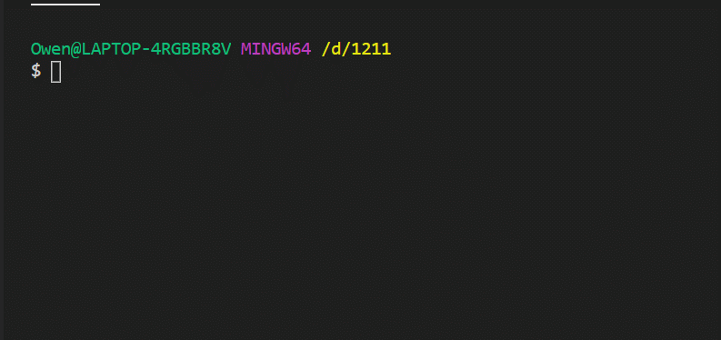

# combination_problem_1211

## Feature

- From **items** select **requestAmount** number of pets.
- List all combination

## Input

- requestAmount: number

- items:Item[]

## Output

- combination:Item[][]

## Run the Solution

```
yarn
yarn start
```

## Result

